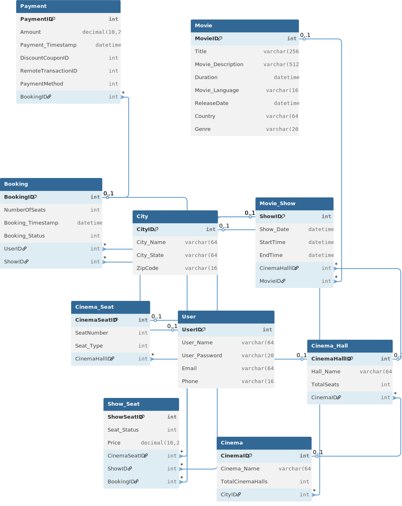

# Boxoffice - Movie Ticket Booking System

Boxoffice is a comprehensive, full-stack web application designed to simulate a real-world movie ticket booking service. It features a complete monorepo structure with a React frontend, a Node.js/Express backend API, and a MySQL database.

The application provides two distinct experiences:
* **User Interface**: A public-facing site where users can browse movies, find theaters, select seats, and book tickets.
* **Admin Dashboard**: A protected, all-in-one management panel for administrators to control every aspect of the application, from adding movies and shows to managing users and viewing analytics.

---

## ✨ Key Features

### For Users
* **Movie Discovery**: Browse movies by city, genre, language, and more.
* **Theater & Showtimes**: Find theaters in a city or see which theaters are playing a specific movie.
* **Interactive Seat Map**: A visual, clickable seat selection UI showing seat types, prices, and availability.
* **Full Booking Workflow**: A seamless, multi-step process from seat selection to payment confirmation.
* **Secure Authentication**: User registration with OTP (One-Time Password) verification, secure login, and password reset.
* **Profile Management**: Users can update their profile details, change their password, and view their complete booking history.
* **Movie Reviews**: Users can read and post reviews for movies.

### For Administrators
* **Secure Admin Login**: Separate login for users with admin privileges.
* **Full CRUD Operations**: Admins can Create, Read, Update, and Delete:
    * Movies (including poster uploads)
    * Cities
    * Theaters (Cinemas)
    * Theater Halls (with complex seat map generation)
    * Showtimes (with custom pricing per seat type)
* **User Management**: View all users and toggle their admin status.
* **Booking Management**: Search for any user's booking (by ID, email, or phone) and cancel it if needed.
* **Analytics Dashboard**: View high-level KPIs like total revenue, daily bookings, and average occupancy.
* **Financial Reports**: See charts for revenue over time, revenue by movie, and revenue by theater.

---

## 💻 Tech Stack

| Area | Technology |
| :--- | :--- |
| **Frontend** | React, Vite, Axios, CSS |
| **Backend** | Node.js, Express.js |
| **Database** | MySQL (with `mysql2` driver) |
| **Authentication** | `express-session` (with `express-mysql-session` store), `bcrypt` |
| **File Uploads** | `multer` (for processing) & `cloudinary` (for cloud storage) |
| **Scheduled Jobs** | `node-cron` (for cleaning up expired bookings) |

---

## 🏛️ Architecture & Database Design

The project is a **monorepo** containing three main components: `frontend`, `backend`, and `database`.

* The **`frontend`** is a React client that makes API requests to the backend.
* The **`backend`** is an Express server that handles all logic and database queries.
* The **`database`** folder contains the MySQL schema and data-seeding scripts.

### Entity-Relationship Diagram (ERD)

This diagram shows the database schema, including all tables and their relationships.



### Data Flow Diagrams (DFD)

These diagrams illustrate how data moves through the system.

**DFD - Level 0 (Context Diagram)**: This shows the entire application as a single process and its interaction with external entities (User and Admin).


**DFD - Level 1 (Process Diagram)**: This breaks down the main "BookMyShow" system into its core processes (e.g., "Manage User", "Manage Booking", "Manage Admin") and shows how data flows between them and the data stores (tables).


---

## 📂 Project Structure

```

.
├── backend/
│   ├── app.js                \# Main server entry point
│   ├── package.json
│   ├── config/               \# Database connection (db.js) & SSL cert
│   ├── controllers/          \# Business logic (adminController.js, authController.js, etc.)
│   ├── middlewares/          \# Auth checks (isAdmin.js, isAuthenticated.js) & file uploads
│   ├── models/               \# Database queries (userModel.js, movieModel.js, etc.)
│   ├── routes/               \# API endpoint definitions (admin.js, auth.js, etc.)
│   └── utils/                \# Helper scripts (cloudinary.js, cleanupService.js)
│
├── database/
│   ├── smb.sql               \# The complete database schema (tables, triggers, procedures)
│   ├── populate.sql          \# A script to populate the DB with 10,000+ shows & data
│   ├── insert.sql            \# A minimal script for testing
│   ├── ER.svg                \# Entity-Relationship Diagram
│   ├── level0.svg            \# Data Flow Diagram (Level 0)
│   └── level1.svg            \# Data Flow Diagram (Level 1)
│
├── frontend/
│   ├── index.html            \# Main HTML entry point
│   ├── package.json
│   ├── vercel.json           \# Deployment configuration for Vercel
│   ├── vite.config.js        \# Vite build configuration
│   ├── public/               \# Static assets (logos, images)
│   └── src/                  \# React source code
│       ├── App.jsx           \# Main router setup
│       ├── main.jsx          \# React app entry point
│       ├── components/       \# Reusable UI (Navbar, Sidebar, SeatSelector)
│       ├── Context/          \# Global state (AuthContext.jsx)
│       ├── hooks/            \# Custom hooks (useAuth.jsx)
│       ├── pages/            \# Page-level components (Home, Login, AdminDashboard)
│       └── utils/            \# Utilities (axios.js)
│
└── README.md                 \# This file

````

---

## 🚀 Local Setup & Installation

To run this project locally, you must set up the **Database**, **Backend**, and **Frontend** individually.

### 1. Database Setup

1.  Ensure you have a **MySQL** server running.
2.  Log in to MySQL and create the database:
    ```sql
    CREATE DATABASE smb;
    USE smb;
    ```
3.  Execute the main schema file to create all tables, triggers, and procedures:
    ```bash
    mysql -u your_username -p smb < ./database/smb.sql
    ```
4.  Execute the population script to fill the database with data:
    ```bash
    mysql -u your_username -p smb < ./database/populate.sql
    ```

### 2. Backend Setup

1.  Navigate to the `backend` directory:
    ```bash
    cd backend
    ```
2.  Install all required npm packages:
    ```bash
    npm install
    ```
3.  Create a `.env` file in the `backend` directory and add your credentials:
    ```.env
    # Server
    NODE_ENV=development
    PORT=3000

    # Database Connection
    DB_HOST=localhost
    DB_USER=your_db_user
    DB_PASS=your_db_password
    DB_NAME=smb
    PORT=3306

    # Session
    SESSION_SECRET=a_very_strong_secret_key_here

    # Admin
    ADMIN_SECRET=your_secret_admin_code

    # Cloudinary (for image uploads)
    CLOUDINARY_NAME=your_cloud_name
    CLOUDINARY_API_KEY=your_api_key
    CLOUDINARY_API_SECRET=your_api_secret
    ```

### 3. Frontend Setup

1.  Navigate to the `frontend` directory:
    ```bash
    cd frontend
    ```
2.  Install all required npm packages:
    ```bash
    npm install
    ```
3.  Create a `.env.local` file in the `frontend` directory and point it to your local backend server:
    ```.env
    # The full URL to your local backend API
    VITE_API_URL=http://localhost:3000/api
    ```

---

## ▶️ Running the Application

You must start both the backend and frontend servers.

1.  **Start the Backend Server**:
    From the `/backend` directory:
    ```bash
    node app.js
    ```
    *(The server will run on `http://localhost:3000`)*

2.  **Start the Frontend Server**:
    From the `/frontend` directory:
    ```bash
    npm run dev
    ```
    *(The server will run on `http://localhost:5173`)*

You can now access the application at `http://localhost:5173` in your browser.
